# OpenCC

Automatic driving long tail / corner cases datasets

Corner cases (CC) are data that occur infrequently or represent a critical situation and are only available in datasets to a limited extent, if at all. However, for ma- chine learning (ML), CC are important as they are required for training, verification, and improved performance of ML models during inference within automated driving systems.

:book: <a href="./paper/"> Corner cases (CC) papers </a>

 

## Download

**Open datasets:**

- https://coda-dataset.github.io/download.html
- https://once-for-auto-driving.github.io/download.html#downloads
- https://www.cityscapes-dataset.com/downloads
- https://github.com/waymo-research/waymo-open-dataset

 

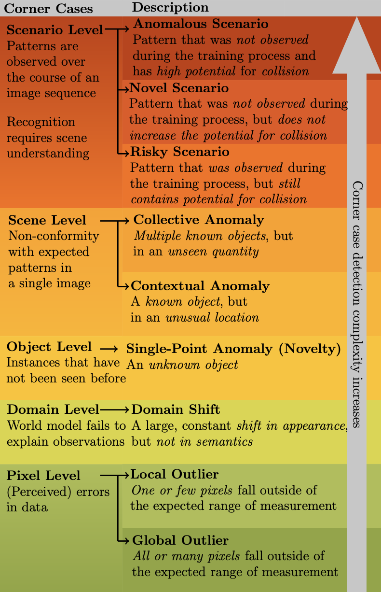

## Corner cases in levels

Automated driving has become a major topic of interest not only in the active research community but also in mainstream media reports. Visual perception of such intelligent vehicles has experienced large progress in the last decade thanks to advances in deep learning techniques but some challenges still remain. One such challenge is the detection of corner cases. They are unexpected and unknown situations that occur while driving. Conventional visual perception methods are often not able to detect them because corner cases have not been witnessed during training. Hence, their detection is highly safety-critical, and detection methods can be applied to vast amounts of collected data to select suitable training data. A reliable detection of corner cases will not only further automate the data selection procedure and increase safety in autonomous driving but can thereby also affect the public acceptance of the new technology in a positive manner. In this work, we continue a previous systematization of corner cases on different levels by an extended set of examples for each level. Moreover, we group detection approaches into different categories and link them with the corner case levels. Hence, we give directions to showcase specific corner cases and basic guidelines on how to technically detect them.

Systematization of corner cases on different levels as given in [1]. The theoretical complexity of the detection typically increases from the bottom to the top.

 

 

## Some examples

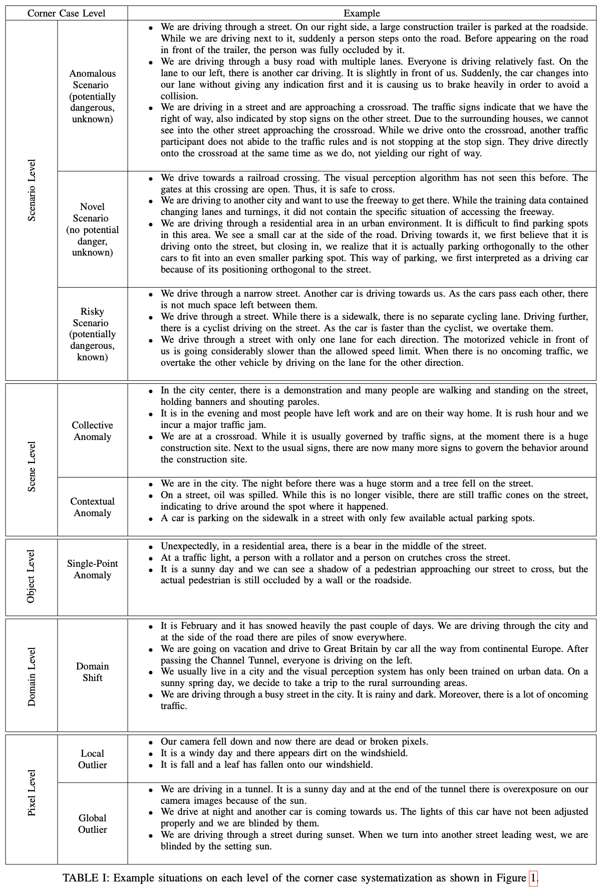

**Scene 1**: A cyclist holds a stop sign sign sign in his hand. We don’t know when it’s going to lift the sign. A driverless car must understand this scenario. Even if he raises the Stop Sign sign, the autopilot should not stop.

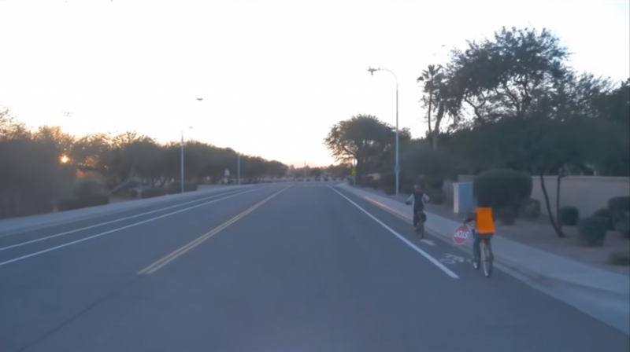

**Scene 2**: The oncoming vehicles loaded with plastic pipes are scattered all over the place. The autopilot must learn to deal with this sudden situation and avoid their influence on the driverless vehicle.

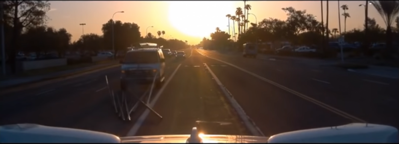

**Scene 3**: Due to road construction and other factors, the pavement is covered with cone barrels. The unmanned vehicle must recognize these scenes correctly and realize reasonable driving in the scene full of cone barrels on the road.

**Scene 4**: The traffic light is green, and the unmanned vehicle has the right of way. Although our unmanned vehicle arrives at the intersection first, it must give way to the special vehicles that will arrive later.

**Scene 5**: When there is a green light at the intersection, the unmanned vehicle is ready to turn left. When encountering the social vehicles running through the red light at high speed, the unmanned vehicle needs to identify this scene and stop in time to avoid the illegal vehicles.

**Scene 6**: A building facade reflecting cars. How does the machine “understand” that the cars are behind you though you see them in front of you and accordingly instruct the self-driven car to reverse or move forward?

<table class="table table-striped table-bordered table-vcenter">
	<tr>
	  <td>
	  	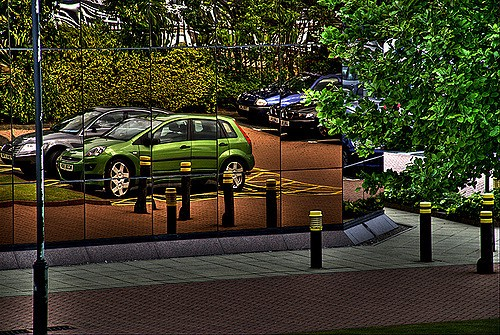
	  </td>
	  <td>
	  	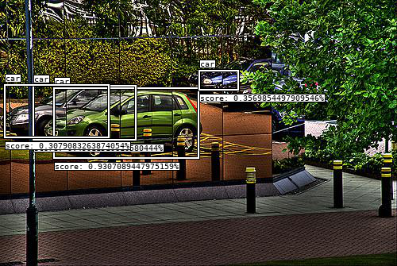
	  </td>
	</tr>
</table>

Fig2 A building facade reflecting cars

**Scene 7**: These scenarios are plenty. Here is one more illustration. How do you read this situation… see figure 2 — is there a building (clock tower) in front of the vehicle or is the vehicle on a road in front of a tram?

<table class="table table-striped table-bordered table-vcenter">
	<tr>
	  <td>
	  	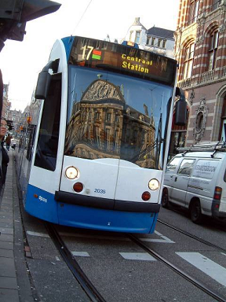
	  </td>
	  <td>
	  	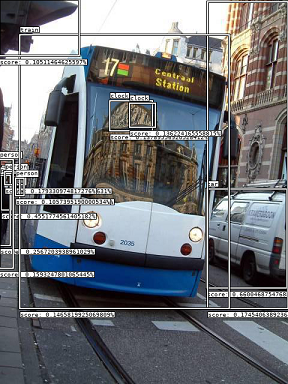
	  </td>
	  <td>
	  	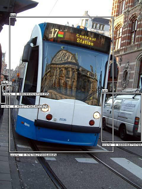
	  </td>
	</tr>
</table>

Fig3 Tram Example (Figure 1,2,3)

**Scene 8**: Traffic Lights

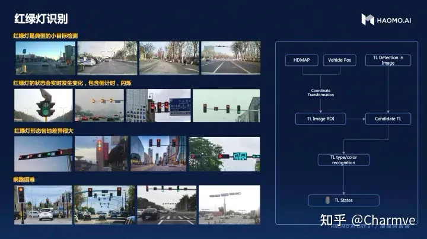

在自动驾驶中，红绿灯感知模块通常会被当做一个单独的子模块进行单独设计，本文针对红绿灯感知过程中存在的部分问题进行汇总，以达到共同讨论，共同解决行业难点问题的目标。

**1. 图像识别问题汇总**

【corner case1】故障灯识别（长时间黑灯，长时间黄灯闪烁），远距离容易识别错误问题

【corner case2】闪烁状态识别（红灯闪烁，黄灯闪烁，绿灯闪烁）

【corner case3】远距离条件下，小目标红绿灯识别（高速120km/h下，至少要看到200m远）

【corner case4】太阳光干扰（逆光、光照不足导致图像灯盘颜色过浅，近似黑灯）

【corner case5】抓拍灯干扰（夜间抓拍灯过亮，导致图像过曝，图像灯盘无法分别轮廓边界）

【corner case6】镜头受到污渍干扰（夜间抓拍灯过亮，导致图像过曝，图像灯盘无法分别轮廓边界；雨雪遮挡镜头导致无法抓拍到易识别的图像登）

【corner case7】适配各式各样的交通灯检测识别（竖条灯<常见>，横条灯<常见>，临时竖灯，读条横灯，读条竖灯，高速通道灯，非机动车道灯，人行横道灯，单组灯，两组灯，三组灯，四组灯，箭头灯，圆头灯等）

[1] 读条竖灯

[2] 读条横灯

[3] 三箭头灯

[4] 倒计时与灯盘上

[5] 倒计时在灯盘一侧（通常在灯盘右侧）

【corner case8】交通灯背景干扰（常规背景为天空、树木，不常见的背景包括各式各样的建筑物、广告牌背景）

【corner case9】LED闪烁问题（一些不合规的交通灯存在LED闪烁，人眼看到灯有颜色，图像抓拍到的为黑色）

【corner case10】动态交通灯问题（部分城市的部分交通灯，会根据交通流或者施工情况调整多组灯中灯亮的状态，例如两组灯，一个左转，一个直行灯，在某些时段，只让一个灯亮，容易造成规控无法对应交通灯进行决策，导致该停车不停，该前进不走等问题）

【corner case11】倒计时识别问题（倒计时数字牌往往更小，而且布局各不相同，通常常见的布局包括，单独倒计时牌<立于竖灯右侧或头顶>，与灯牌一体倒计时<立于灯盘中间>；倒计时数字也不相同，通常有个位数字和两位数字，两位数字存在01、02...，最大数字可以到99；夜晚识别倒计时牌容易受到大光晕干扰，造成肉眼无法识别数字；在较远地方，倒计时牌无法识别等问题）

【corner case12】箭头指向、圆头识别问题（较远的地方，箭头与圆头类型容易混淆，箭头指向识别准确度较低等问题）

**2. 依赖高精地图识别红绿灯问题汇总**

【corner case1】多颗摄像头切换选择问题。自动驾驶中通常至少需要两颗摄像头(远/近焦距)来完成红绿灯图像采集问题，但依赖高精地图方案中，最终只会选择一张图像完成检测识别过程，精确的选择哪一张图像来完成后续过程需要在大量的试用过程中不断调优，从而适配各式各样的场景。

【corner case2】左转待转区采用右前侧宽视角摄像头图像，当左转待转区距离直行交通灯较远时，存在右前侧摄像头成像无法区分红绿灯颜色（即红绿灯在图像上无论是红、黄、绿哪种颜色，肉眼看都是黑色）

【corner case3】左转待转区采用右前侧宽视角摄像头图像，当左转待转区距离直行交通灯较远时，倒计时功能无法正常使用，人眼无法从图像中区分数字

【corner case4】高精地图中是按照车道线lane id与交通灯signal id一一对应绑定，由于检测模型会搜索到感兴趣区域中的全部近似红绿灯灯框，进而再与高精地图通过位置相近计算进行匹配。因此在直行道路，左转待转道路等需要绑定红绿灯的场景中，地图中需要将全部交通灯进行绑定。由于高精地图中绑灯是人工完成的，往往容易出现制图中针对废灯(不亮，一直为黑灯)容易出现忘记绑定问题，最终导致匹配时，可能出现匹配错误问题

【corner case5】高精地图中存在单lane id绑定多signal id问题，规则的不一致性容易导致匹配问题

【corner case6】高精地图中由于最终绑定signal id的lane id往往比较短，但是现实情况要求自动驾驶车辆需要在非常远处能够看到交通灯，因此需要通过对地图中lane id后继车道线进行查询，并且确认后继车道线是否绑定红绿灯，而最终推导出100米甚至是200米远的距离中是否存在红绿灯，进而决定是否开启交通灯识别功能

【corner case7】在自动驾驶汽车越过停止线后，自车所处的lane id也会随之改变，但这个时候汽车需要继续观测交通灯，来辅助车辆不闯红灯，因此需要对之前的lane id进行查询。通常要获取之前的lane id有两种方式，一种是短暂记忆刚刚经过的lane id(绑灯)，一种是设计前继查询lane id(绑灯)

【corner case8】左转待转区停止线前方有专门的左转交通灯，进入左转待转区前正前方有左转灯和直行灯，当前路口相当于有两组灯，一组为单独的专门辅助的左转交通灯，一组为直行+左转灯。

**Scene 9**: 交通标识牌

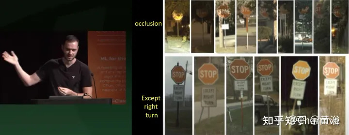

<!--   template jpg --
<table class="table table-striped table-bordered table-vcenter">
	<tr>
	  <td>
	  	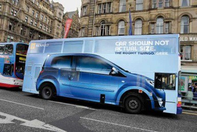
	  </td>
	  <td>
	  	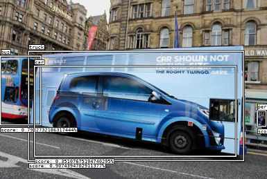
	  </td>
	</tr>
</table>
-->

## What is it and how to address? 

- Tweak model

Increase threshold in existing model: There is a confidence level associated with every object (which is here plotted for your understanding). A straightforward way would be to increase the threshold. In the tram example when I do that the building (clock) goes away (Figure 3). Great, this solves the problem. We have to be careful here to double check if we are losing any crucial information. The below typical street scene will illustrate this aspect. Like in the tram example here too we detect objects (pedestrians) in the puddle and more critically we detect a traffic light in the reflection which will confuse the machine in the vehicle.

<table class="table table-striped table-bordered table-vcenter">
	<tr>
	  <td>
	  	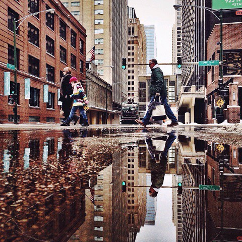
	  </td>
	  <td>
	  	
	  </td>
	</tr>
</table>

We can increase the threshold but as can be seen below while the reflected pedestrian goes away we also miss some crucial information like the actual traffic light, the vehicle at a distance and a few pedestrians that are not identified. Increasing threshold is a strategy but beware of this risk

- Others

expert system 

inverse reinfocement learning

data-driven perception-prediction mutil-task model training in large scale

## 交流群

> 完整论文合集下载，公众号 **"迈微AI研习社"** 后台回复“自动驾驶数据驱动论文集”关键字获取。

自动驾驶技术参考交流群（知识星球）来了！想要了解最新最快最好的自动驾驶CV/DL/ML论文速递、自动驾驶系统优化、商业分析、优质开源项目、学习教程和实战训练等资料，欢迎扫描下方二维码，加入自动驾驶技术交流群，已汇集数千人！

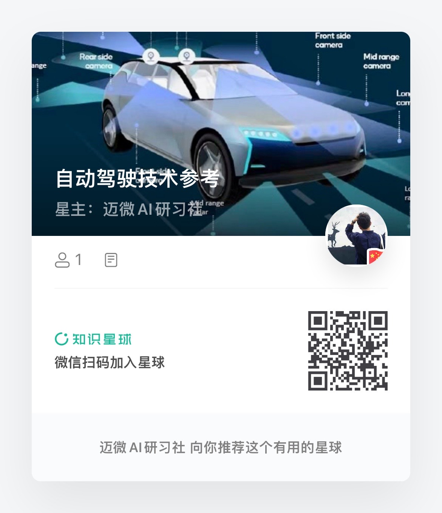

<h5>扫描加入交流群</h5>

## Reference

- https://developpaper.com/waymo-automatic-driving-long-tail-challenge-2019/
- https://harshaangeri.medium.com/mirror-mirror-on-the-wall-ai-deep-learning-needs-to-learn-it-all-ad221bd399e1
- https://zhuanlan.zhihu.com/p/401235846
- https://github.com/PointsCoder/ONCE_Benchmark

## 重要参考文献

[1] “Systematization of Corner Cases for Visual Perception in Automated Driving,” IV, Las Vegas, USA, 2020.

[2] “Towards Corner Case Detection by Modeling the Uncertainty of Instance Segmentation Networks,” in Proc. of ICPR, Workshop, Milan, Italy, 2021.

[3] "An Application-Driven Conceptualization of Corner Cases for Perception in Highly Automated Driving". Florian Heidecker, CVPR 2021. https://arxiv.org/pdf/2103.03678.pdf

[4] "Pixel-wise Anomaly Detection in Complex Driving Scenes". Giancarlo Di Biase. CVPR 2021. https://arxiv.org/pdf/2103.05445.pdf. https://github.com/giandbt/synboost. https://github.com/tianyu0207/PEBAL

[5] “Corner Cases for Visual Perception in Automated Driving: Some Guidance on Detection Approaches,” arXiv:2102.05897, 2021.

[6] “Open-Set Radar Waveform Classification:Comparison of Different Features and Classifiers,” IEEE International Radar Conference, Washington DC, 2020.

[7] “Entropy Maximization and Meta Classification for Out-of-Distribution Detection in Semantic Segmentation,” arXiv:2012.06575, 2020.

